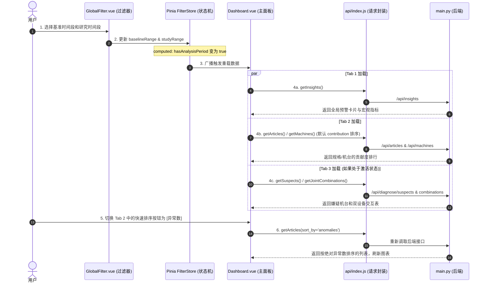

# 📊 轮胎质量分析看板：系统架构与数据流转设计文档

本文档详述了轮胎质量分析看板重构后的技术架构、项目目录规范、API 接口契约（Data Contracts）以及前端分层交互与数据流转逻辑，以确保前后端解耦开发和便于调试。

---

## 1. 项目目录结构范式 (Project Directory Structure)

本系统遵循前后端分离的标准开发范式，结构如下：

```
untitled1/
├── backend/                  # 后端项目 (FastAPI + DuckDB)
│   ├── main.py               # 主入口，定义路由、业务与诊断逻辑
│   ├── requirements.txt      # 依赖包声明
│   └── tests/                # 单元测试与接口测试脚本
├── src/                      # 前端项目 (Vue 3 + Pinia + ECharts)
│   ├── assets/               # 公共样式与静态资源
│   ├── api/                  # 接口请求层
│   │   └── index.js          # API 请求封装与统一暴露
│   ├── store/                # 状态管理层
│   │   └── filter.js         # 全局过滤器与下钻状态管理 (Pinia Store)
│   ├── components/           # UI 组件
│   │   ├── charts/           # 图表组件 (TrendChart, ArticleBarChart, MachineChart)
│   │   └── panels/           # 结论及深度面板 (InsightsPanel, DiagnosticsPanel)
│   ├── views/                # 视图页面
│   │   └── Dashboard.vue     # 主面板 (包含 3 个横向 Tab)
│   ├── App.vue               # 根组件
│   └── main.js               # 前端初始化入口
├── docs/                     # 架构与开发文档
│   └── architecture_design.md# 本文档
└── README.md                 # 项目启动说明
```

---

## 2. 后端 API 接口契约与数据结构 (API Data Contracts)

### 2.1 `/api/articles` (规格排行)
* **功能描述**：未选择时间段时按异常数排序，选择基准期/研究期时按 Shift-Share 贡献度排序。
* **Method**: `GET`
* **Query Parameters**:
  * `baseline_from`, `baseline_to`, `study_from`, `study_to` (形式为 `YYYY-MM-DD`，可选)
  * `sort_by` (`contribution` | `anomalies`，默认 `contribution`)
  * `limit` (默认 20)
* **Response (无时间段)**:
  ```json
  {
    "status": "success",
    "data": [
      {
        "article10": "1000123001",
        "total": 4580,
        "anomalies": 120,
        "anomaly_rate": 2.62
      }
    ]
  }
  ```
* **Response (已选择时间段)**:
  ```json
  {
    "status": "success",
    "data": [
      {
        "article10": "1000123001",
        "total": 3120,          // 研究期产量
        "anomalies": 85,        // 研究期异常量
        "anomaly_rate": 2.724,  // 研究期异常率 %
        "contribution": 0.3542, // Shift-Share 贡献百分点
        "abs_contribution": 0.3542
      }
    ]
  }
  ```

---

### 2.2 `/api/machines` (机台排行)
* **功能描述**：返回熔解了 12 个工位后的机台排行。
* **Method**: `GET`
* **Query Parameters**: Same as `/api/articles`, with `sort_by` being `contribution` | `step_lift` | `anomalies`.
* **Response (已选择时间段)**:
  ```json
  {
    "status": "success",
    "data": [
      {
        "workcenter_col": "inner_liner_workcenter",
        "machine": "inner_liner_workcenter:12",
        "total": 12040,
        "anomalies": 210,
        "anomaly_rate": 1.744,
        "contribution": 0.1245,
        "abs_contribution": 0.1245,
        "step_lift": 1.824
      }
    ]
  }
  ```

---

### 2.3 `/api/insights` (自动预警结论)
* **功能描述**：用于 Tab 1 顶部，直接输出由后端判定好的质量风险结论和建议。
* **Method**: `GET`
* **Query Parameters**: `baseline_from`, `baseline_to`, `study_from`, `study_to` (可选)
* **Response**:
  ```json
  {
    "status": "success",
    "data": {
      "overall": {
        "baseline_rate_pct": 2.1,
        "study_rate_pct": 2.6,
        "delta_pct": 0.5
      },
      "alerts": [
        {
          "level": "high" | "medium" | "info",
          "category": "machine" | "lot" | "article" | "overall",
          "title": "风险项标题",
          "detail": "基于公式计算出的具体事实细节描述",
          "diagnosis": "设备系统性工艺漂移" | "全局物料批次缺陷" | "机台-批次适配性故障" | null,
          "suggestion": "给车间操作人员的具体排查建议措施",
          "metrics": { ... } // 保留原始计算数据供前端提示/调试
        }
      ]
    }
  }
  ```

---

### 2.4 `/api/diagnose/suspects` (嫌疑机台清单)
* **功能描述**：根据 Step Lift 筛选出研究期内所有异常率高于均值的物理机台（Step Lift $\ge 1.5$）。
* **Method**: `GET`
* **Query Parameters**: `study_from`, `study_to`
* **Response**:
  ```json
  {
    "status": "success",
    "data": [
      {
        "machine": "ct_workcenter:M023",
        "workcenter_col": "ct_workcenter",
        "step_lift": 2.34,
        "anomaly_count": 89,
        "anomaly_rate": 5.42,
        "diagnosis": "设备系统性工艺漂移"
      }
    ]
  }
  ```

---

### 2.5 `/api/diagnose/combinations` (双机台联合风险)
* **功能描述**：寻找加工路径上同时出现 $M_1$ 和 $M_2$ 设备时导致的质量风险提升。
* **Method**: `GET`
* **Query Parameters**: `study_from`, `study_to`, `min_matches` (默认 50)
* **Response**:
  ```json
  {
    "status": "success",
    "data": [
      {
        "machine_a": "ct_workcenter:M023",
        "wc_a": "ct_workcenter",
        "machine_b": "gt_workcenter:G012",
        "wc_b": "gt_workcenter",
        "total_matches": 150,
        "anomaly_matches": 18,
        "joint_anomaly_rate": 12.0,
        "joint_lift": 4.62
      }
    ]
  }
  ```

---

### 2.6 `/api/diagnose/lots` (物料批次诊断)
* **功能描述**：针对特定嫌疑机台，诊断其下所有使用批次的 Local/Cross Lift，解耦人机料法环中的“料”与“机”。
* **Method**: `GET`
* **Query Parameters**: `study_from`, `study_to`, `machine`, `workcenter_col`
* **Response**:
  ```json
  {
    "status": "success",
    "data": [
      {
        "lot_col": "inner_liner_lot",
        "lot_val": "LOT-89210",
        "lot_total": 120,
        "lot_anomaly": 15,
        "lot_anomaly_rate": 12.5,
        "local_lift": 2.3,
        "cross_machine_lift": 1.05,
        "diagnosis": "全局物料批次缺陷",
        "suggestion": "该批次在全场各机台上异常率均高，为批次自身缺陷，建议封存追溯"
      }
    ]
  }
  ```

---

## 3. 前端数据流转与状态管理 (Data Flow Blueprint)



---

## 4. UI 视觉交互规范 (UI Layout & Styling Guide)

1. **预警警报器 (InsightsPanel)**：
   - 采用 Flex 栅格排版，不同风险级卡片等高。
   - 内部文本采用结构化标签设计：
     * `💡 判定`：使用加粗中灰色 (`#374151`)。
     * `🔧 建议`：使用加粗主题色，并在文本开头追加对应的状态小图标。
2. **极简图表 (TrendChart / ArticleBarChart / MachineChart)**：
   - 全局图表使用 ECharts 的 `autoresize`，适应窗口宽度缩放。
   - 柱子颜色采用线性渐变：
     * 异常量大时，显示深红 (`#dc2626`) 至渐变淡红的过渡，极具视觉张力。
3. **条件控制栏 (Filter Bar)**：
   - 精细调整 Element Plus 组件的尺寸为 `small`。
   - 双日期范围选择器中间用 `→` 连接。
   - 栏体增加背景虚化特效，防止与正文内容重叠时造成的视觉混乱。
