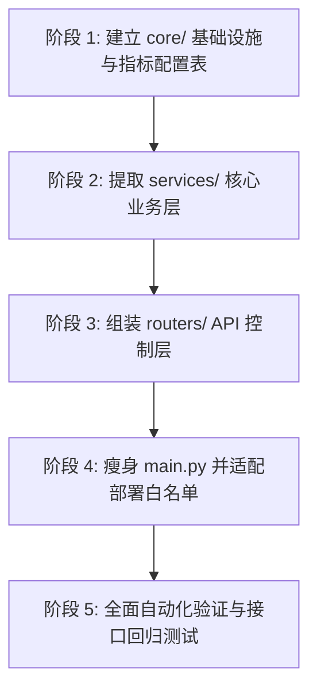

# 后端架构模块化与数据驱动高复用重构方案 (V3.0 精简架构版)

> **文件属性**：架构重构技术设计规范 (Technical Architecture Design Specification)  
> **版本迭代**：V3.0（经专项审查，彻底剔除“为使用对象而使用对象”的过度设计，全面转向**数据驱动配置 + 纯函数 + 高内聚服务**）  
> **适用范围**：`backend/` 后端整体工程解耦与模块化重构  
> **文档目标**：供技术审查与后续自动化实施的唯一权威执行依据。

---

## 1. 背景与现状诊断 (Context & Problem Diagnosis)

目前后端核心业务全部堆叠在单文件 [`backend/main.py`](file:///d:/Ava/untitled1/untitled1_v2/backend/main.py) 中，完成第一阶段死代码清理后仍有 **6,018 行**（约 285KB），带来了严重的维护性瓶颈与架构隐患：

1. **强耦合的超大单体 (Monolithic Coupling)**：
   - FastAPI 路由声明、SQL 动态拼接、DuckDB 连接管理、复杂算法、业务统计、参数推荐、静态资源代理全部揉在一个文件中。
   - 违反**单一职责原则 (SRP)**，任何微小改动都有引发非预期副作用的风险。
2. **大面积重复计算与胶水代码 (Widespread Duplicate Logic)**：
   - **指标判断分散**：全站涉及 4 大质量指标（`rfpp` 径向力峰峰值、`rfh1` 径向力一次谐波、`cony` 锥度力、`weight` 胎重偏差）。在 `main.py` 中出现多达 **38 处** 硬编码的 `if indicator == "weight": ... elif indicator == "cony": ... else: ...` 分支判断。
   - **工序全流程映射重复**：13 道关键工序（胎面、胎圈、内衬、胎侧、带束层1/2、帘布层1、冠带层1/2、成型GT、硫化CT、终检TU、动平衡TB）的字段映射与拓扑流转，在桑基图、最优路线、组合树中各自重复定义。
   - **调参影响度评估重复**：CGRS 调参事件前后的时序窗口切片、正态分布拟合、CPK 改善差值（`cpk_diff`）与 `YoY%` 计算，在“对照分析”与“参数推荐”中各自实现了一套。
3. **定位困难与认知负荷极高 (High Cognitive Load & Poor Locality)**：
   - 开发者或审查 Agent 查找一个接口的具体业务逻辑，必须在数千行的代码中进行全文检索；
   - 命名空间污染严重，全局变量缺乏清晰的生命周期保护。

---

## 2. 专项审查：剔除“为使用对象而使用对象”的过度设计 (Anti-Overengineering Audit)

在此前的重构草案中，曾规划了大量的抽象基类、多层派生子类与工厂模式（如 `BaseIndicator`、`BaseFlowAnalyzer`、`BaseCgrsImpactEvaluator` 等，整体设计膨胀至 24 个文件）。

经专项技术审查，我们在 Python 工业级后端设计中确立以下原则：
> **无运行时内部状态（Stateless）的业务，坚决不要搞类继承；数据能表达的规则，坚决不要写成类。**

### 审查发现的 3 处典型过度设计与精简方案对比

| 模块 | 审查前的过度设计 (Java 式硬套 OOP) | 审查后的精简设计 (Pythonic 数据驱动与纯函数) | 精简与架构收益 |
|---|---|---|---|
| **1. 四大指标体系** | `BaseIndicator` 抽象基类 + 4 个子类 + `factory.py`（**共 6 个类文件**） | **单个 `backend/core/indicators.py` 文件**：<br>`INDICATOR_CONFIG` 数据字典 + 3 个纯函数 (`resolve_col_name`, `get_tolerance`, `calc_metric`) | **净减 5 个文件**；查表 $O(1)$ 直接分发，消灭所有 38 处分支，全厂指标规则一屏看尽 |
| **2. 工序全流程分析** | `BaseFlowAnalyzer` 模板基类 + `ProcessSankeyService` + `BestProcessPathService`（**3 个类层级**） | **单个 `backend/services/process_flow_service.py` 文件**：<br>13 道工段静态有序拓扑列表 `WORKCENTER_STAGES` + 3 个纯函数 (`get_process_sankey`, `get_best_process_sankey`, `get_machine_combination_tree`) | **消除虚假模板类**；工段映射只定义一次，杜绝多余的类实例化与 `self` 传参开销 |
| **3. CGRS 调参评估** | `BaseCgrsImpactEvaluator` 抽象基类 + 3 个派生子类（**4 个类层级**） | **单个 `backend/services/cgrs_service.py` 文件**：<br>高内聚无状态纯函数流，由统一的 `_eval_event_improvement` 承载两级兜底计算 | **消除 4 个空壳类**；两级兜底与强规格锁定集中在单一业务引擎中，代码行数与调用栈减半 |
| **4. 机台与规格服务** | 避免建立只有 `@staticmethod` 的“伪 Service 类” | 直接按业务领域组织为模块化纯函数（如 `get_machine_cpk(...)`, `get_top_warning(...)`） | 无需写空壳 `class MachineService:`，导入即用，代码最透明、执行最快 |

---

## 3. 目标目录与模块拓扑结构 (Directory & Module Topology)

整个后端由原本臃肿混乱的单文件解耦为层次分明、轻量现代的结构，**文件数从原本过度设计的 24 个锐减至 15 个**：

```
backend/
├── core/                               # [基础设施与公共配置] 纯底层无业务状态
│   ├── __init__.py
│   ├── config.py                       # 路径探测、数据文件搜索与基础配置常量
│   ├── db.py                           # DuckDB 内存表常驻连接、数据热重载 reload、原生 qry() (遵指示不加锁)
│   ├── cache_utils.py                  # ⭐ 通用 TTL 内存缓存 (迁移原 5098~5108 `_recommend_cache_*`，供各处复用)
│   ├── indicators.py                   # ⭐【指标集中配置表】INDICATOR_CONFIG + 纯函数 (彻底消灭 38 处 if-else)
│   │                                  #   ⚠️ 依赖边界：仅可 import core/cpk、core/db，严禁依赖 services（避免环依赖）
│   ├── time_utils.py                   # 生产日期划分 (08:00~次日08:00)、三班筛选 SQL 构造器
│   ├── cpk.py                          # 统一标准 CPK 算法 [-5.0, 5.0] + resolve_spec_tolerance (原样迁移查库/group 回退口径)
│   └── serializer.py                   # 递归 sanitize_data (防 NaN/Infinity 序列化异常)
│
├── services/                           # [业务服务层] 纯模块化业务函数与数据驱动流 (无空壳类)
│   ├── __init__.py
│   ├── article_service.py              # 规格看板业务 (全量规格、预警看板、条码明细散点、批次趋势)
│   ├── machine_service.py              # 机台分析业务 (机台 CPK、多机对比、Top3 负贡献排行、最优 TU)
│   ├── process_flow_service.py         # ⭐ 全流程工序拓扑 (静态 13 工段 WORKCENTER_STAGES + 桑基图 + 组合树)
│   ├── cgrs_service.py                 # ⭐ CGRS 工艺调参 (时序对比 + 强规格锁定与两级兜底推荐引擎)
│   └── trend_service.py                # 全厂宏观趋势、全局筛选器元数据
│
├── routers/                            # [API 控制层] 仅负责 HTTP 入参提取校验、调用 Service、返回响应 (<20 行/路由)
│   ├── __init__.py
│   ├── articles.py                     # /api/articles/*, /api/article/*
│   ├── machines.py                     # /api/machines/*
│   ├── cgrs.py                         # /api/cgrs/*
│   ├── trend.py                        # /api/trend/*, /api/filters/*
│   └── system.py                       # /api/etl/*, /api/system/*
│
├── etl/                                # [ETL 数据管线] (现有模块，保持原样)
│   ├── clean_data.py
│   ├── fetch_data.py
│   └── ...
│
├── main.py                             # [系统主入口] 从 6,018 行大幅精简至 < 80 行
└── run_server.py                       # 服务启动脚本 (保持 uvicorn 入口与 NSSM 兼容)
```

---

## 4. 重复计算与业务流程的“数据驱动与纯函数”详细设计

### 4.1 指标体系：配置字典驱动 + 纯函数（彻底消灭 38 处分支判断）

文件路径：[`backend/core/indicators.py`](file:///d:/Ava/untitled1/untitled1_v2/backend/core/indicators.py)

```python
# -*- coding: utf-8 -*-
"""
轮胎四大指标集中配置表与纯函数工具库
消灭全项目所有散落的 if indicator == '...' 分支
⚠️ 依赖边界：本模块仅允许 import backend/core (cpk/db)，严禁反向依赖 services。
"""
from typing import Optional, Tuple
from backend.core.cpk import calc_cpk
from backend.core.db import qry

# 真实口径核对：与 main.py get_spec_usl(405)/get_spec_limits(490) 完全一致
INDICATOR_CONFIG = {
    "rfpp": {
        "label": "RFPP 径向力峰峰值",
        "raw_col": "rfppwc_first",
        "target_col": None,
        "limit_type": "single_sided",     # 单侧上限 USL
        "metric_type": "cpk",             # 走标准 CPK
        "lookup_unscaled_col": "standard_rfpp",   # 查库列 (基准值*10 = USL)
        "group_fallback_base": {          # 查不到标准值时按 GROUP 回退 (基准值*10)
            "GROUP 1": 10.5, "GROUP 2A": 11.5, "GROUP 2B": 12.5,
            "GROUP 3": 12.5, "GROUP 4": 14.5,
        },
        "default_usl": 100.0,             # 无 article10 / 库全空 → 兜底
        "default_lsl": None,
    },
    "rfh1": {
        "label": "RFH1 径向力一次谐波",
        "raw_col": "rfh1wc_first",
        "target_col": None,
        "limit_type": "single_sided",
        "metric_type": "cpk",
        "lookup_unscaled_col": "standard_rfh1",
        "group_fallback_base": {
            "GROUP 1": 7.5, "GROUP 2A": 8.5, "GROUP 2B": 9.0,
            "GROUP 3": 9.5, "GROUP 4": 10.0,
        },
        "default_usl": 100.0,             # 注意：真实兜底是 100.0 而非 75.0
        "default_lsl": None,
    },
    "cony": {
        "label": "CONY 锥度力",
        "raw_col": "cony_first",
        "target_col": None,
        "limit_type": "double_sided",     # 双侧上下限 [LSL, USL]
        "metric_type": "cpk",
        "lookup_usl_col": "conny_usl",    # 查库双侧限
        "lookup_lsl_col": "conny_lsl",
        "default_usl": 95.0,
        "default_lsl": -95.0,
    },
    "weight": {
        "label": "胎重",
        "raw_col": "tire_weight_actual_first",
        "target_col": "tire_weight_target_first",
        "limit_type": "deviation_pct",    # 均值偏差百分比
        "metric_type": "deviation",       # 维持车间看盘习惯（非 CPK）
        "default_usl": None,              # 无查库，固定 ±0.28%（硬编码于下限函数）
        "default_lsl": None,
    }
}

def resolve_col_name(indicator: str, use_target: bool = False) -> str:
    """获取指定指标对应的 DuckDB 数据列名"""
    cfg = INDICATOR_CONFIG.get(indicator, INDICATOR_CONFIG["rfpp"])
    return cfg["target_col"] if (use_target and cfg["target_col"]) else cfg["raw_col"]

def get_tolerance(indicator: str, article10: Optional[str] = None) -> Tuple[Optional[float], Optional[float]]:
    """统一获取指标的公差限制 (USL, LSL)——原样保留查库与兜底口径。
    等价于旧 get_spec_limits (490)。weight 固定 ±0.28%，rfpp/rfh1 查库+group 回退+100 兜底，
    cony 查 conny_usl/conny_lsl 单侧回退 ±95。
    """
    if indicator == "weight":
        return 0.28, -0.28
    if indicator == "cony":
        if not article10:
            return 95.0, -95.0
        res = qry(
            "SELECT ANY_VALUE(conny_usl) as usl_v, ANY_VALUE(conny_lsl) as lsl_v "
            "FROM clean_yield WHERE article10 = ? AND conny_usl IS NOT NULL AND conny_lsl IS NOT NULL",
            [article10],
        )
        if res and res[0]['usl_v'] is not None and res[0]['lsl_v'] is not None:
            return float(res[0]['usl_v']), float(res[0]['lsl_v'])
        return 95.0, -95.0
    cfg = INDICATOR_CONFIG.get(indicator, INDICATOR_CONFIG["rfpp"])
    usl = _lookup_spec_usl(article10, cfg)
    return usl, None

def _lookup_spec_usl(article10: Optional[str], cfg: dict) -> float:
    """等价旧 get_spec_usl (405)：无 article → 100；有 article → 查标准列，COALESCE 按 GROUP 回退（基准值*10），
    库为空 → 100 兜底。SQL 必须保持与旧 412~450 行同一范式。"""
    if not article10:
        return 100.0
    lookup_col = cfg["lookup_unscaled_col"]
    group_sql = " ".join(
        f"WHEN '{gkey}' THEN {gval}" for gkey, gval in cfg["group_fallback_base"].items()
    )
    sql = f"""
        SELECT COALESCE(ANY_VALUE({lookup_col}),
                        CASE ANY_VALUE("group") {group_sql} END) * 10.0 AS usl
        FROM clean_yield WHERE article10 = ?
    """
    res = qry(sql, [article10])
    if res and res[0]['usl'] is not None:
        return float(res[0]['usl'])
    return 100.0

def calc_metric(indicator: str, mean_val: float, std_val: float, usl: Optional[float] = None, lsl: Optional[float] = None, target_val: Optional[float] = None) -> float:
    """根据指标配置，自动路由是计算标准 CPK 还是均值偏差率"""
    cfg = INDICATOR_CONFIG.get(indicator, INDICATOR_CONFIG["rfpp"])
    if cfg["metric_type"] == "deviation":
        if target_val and abs(target_val) > 1e-6:
            return round((mean_val - target_val) / target_val * 100.0, 4)
        return 0.0
    return calc_cpk(mean_val, std_val, usl, lsl)
```

**业务收益**：
任何服务中无需 `if-elif`，直接查表即可拿到列名、公差和计算结果。单文件即是“单点事实（Single Source of Truth）”，并且 `get_tolerance` **完整保留** 原有「查库 → group 回退 → 硬编码兜底」三层口径，重构后输出与旧版逐字节一致。

> ⚠️ **口径迁移红线**：`_lookup_spec_usl` 中的 SQL 必须从旧 `get_spec_usl`(405~450) **原样复制**（含 `COALESCE(ANY_VALUE(standard_xx), CASE ANY_VALUE("group") ... )*10` 的完整 CASE 表），禁止改写成简化默认值。文档上文 `group_fallback_base` 仅为可读性示意。

---

### 4.2 工序全流程分析：集中静态拓扑 `WORKCENTER_STAGES` + 函数式流转

文件路径：[`backend/services/process_flow_service.py`](file:///d:/Ava/untitled1/untitled1_v2/backend/services/process_flow_service.py)

#### 拒绝过度设计
全流程 13 道工序关系完全是**静态有序拓扑**，没有任何动态继承必要。直接组织：

1. **集中拓扑字典常量**（含节点中文标签，与桑基图 4059~4071 逐字段对齐）：
   ```python
   WORKCENTER_STAGES = [
       {"key": "tread",       "col": "tread_workcenter",           "name": "胎面"},
       {"key": "bead",        "col": "bead_workcenter",            "name": "胎圈"},
       {"key": "inner_liner", "col": "inner_liner_workcenter",     "name": "内衬"},
       {"key": "sidewall",    "col": "sidewall_workcenter",        "name": "胎侧"},
       {"key": "breaker1",    "col": "first_breaker_workcenter",   "name": "带束层1"},
       {"key": "breaker2",    "col": "second_breaker_workcenter",  "name": "带束层2"},
       {"key": "ply1",        "col": "first_ply_workcenter",       "name": "帘布层1"},
       {"key": "cap1",        "col": "wound_cap_ply1_workcenter",  "name": "冠带层1"},
       {"key": "cap2",        "col": "wound_cap_ply2_workcenter",  "name": "冠带层2"},
       {"key": "gt",          "col": "gt_workcenter",              "name": "成型"},
       {"key": "ct",          "col": "ct_workcenter",              "name": "硫化"},
       {"key": "tu",          "col": "tu_first_workcenter",        "name": "终检"},
       {"key": "tb",          "col": "tb_first_workcenter",        "name": "动平衡"},
   ]
   ```
   > ⚠️ **口径红线**：`name` 字段是节点在桑基图中的展示标签，实际值与旧版 `node_map`（如 4105~4113）**逐字段一致**，不得擅自改名（例如不可把「胎面」改成英文或别名），否则前端桑基图节点编码失配。
2. **纯函数对外暴露**：
   - `build_flow_sql(...)`：公共 SQL 生成器
   - `get_process_sankey(...)`：驱动 `/api/machines/process-sankey`
   - `get_best_process_sankey(...)`：驱动 `/api/machines/best-process-sankey`
   - `get_machine_combination_tree(...)`：驱动 `/api/machines/combination-tree`

---

### 4.3 CGRS 调参评估与推荐：两级兜底与强规格锁定业务引擎

文件路径：[`backend/services/cgrs_service.py`](file:///d:/Ava/untitled1/untitled1_v2/backend/services/cgrs_service.py)

#### 核心业务铁律落实
> ⚠️ **强规格锁定与两级兜底铁律 (Strict Spec-Binding & Two-Tier Evaluation)**：
> 1. **强规格锁定原则**：
>    - **成型工段 (GT)**：在 `clean_yield` 中精确筛选过去 30 天生产过该规格的机台；在 `cgrs_records` 中严格匹配 `ProdSpecific2`（仅限该规格全码或前 7 位，完全禁止宽泛跨规格匹配）。
>    - **硫化工段 (CU)**：首先追溯过去 30 天**真实生产过该规格**的硫化机列表；在评估调参前后表现时，**必须且只能采样该指定规格**的轮胎数据。
> 2. **两级评估兜底机制 (Two-Tier Evaluation)**：
>    - **第一优先级（有效路径严格过滤）**：
>      追溯下游完整流转链路（`GT ➔ CT ➔ TU`），筛选出调参前后样本均 $\ge 5$ 且数量失衡比 $\le 2.5$ 的 `effective_paths`，仅提取有效路径内部的条码计算 CPK 改善度（彻底消除下游机台噪声干扰，保证与 CGRS 详情页数据 100% 对齐）；
>    - **第二优先级（样本不足时退避兜底）**：
>      仅在生产条码过于分散、无法凑出成对有效路径时，才退避使用该机台在该指定规格下的调参前后 50 条直查数据进行保底计算。

#### 两端统一驱动，消除接口撕裂与悬空 Bug
- **单机台弹窗推荐**：`recommend_for_machine(machine, article, ...)` $\rightarrow$ 驱动 `/api/cgrs/recommended-params`。
- **全厂最佳工艺图卡片推荐**：`recommend_best_for_spec(article, ...)` $\rightarrow$ 驱动 `/api/cgrs/param-recommendation`。
  - **自动扫描该规格活跃的 GT 和 CU 机台**，补齐此前由于缺失 `_get_same_section_machines` 导致的悬空 NameError Bug，**彻底恢复前端桑基图下方的推荐卡片**！

---

## 5. API 路由与业务拆分完整映射表 (Complete Route Mapping)

| 业务领域 | 拆分后路由文件 | 拆分后服务文件 | 对应原 main.py 位置 | 包含的具体端点 (Endpoint) |
|---|---|---|---|---|
| **系统与运维** | `routers/system.py` | `core/db.py` | 212~224, 1508~1550 | `POST/GET /api/etl/reload` (已去重合并)<br>`GET /api/etl/status`<br>`POST/GET /api/system/restart`<br>`GET /` |
| **规格综合看板** | `routers/articles.py` | `services/article_service.py` | 451~519, 1567~2250, 4330~4690 | `GET /api/articles/all`<br>`GET /api/articles/warning-cpk`<br>`GET /api/articles/barcode-measurements`<br>`GET /api/articles/lot-cpk-trend`<br>`GET /api/articles/lot-barcode-detail`<br>`GET /api/article/phase` |
| **机台分析与下钻** | `routers/machines.py` | `services/machine_service.py` | 2252~2830, 5162~5540 | `GET /api/machines/cpk`<br>`GET /api/machines/cpk/trend`<br>`GET /api/machines/top-warning`<br>`GET /api/machines/best-tu`<br>`GET /api/machines/cpk-trend-comparison` |
| **全流程工序分析** | `routers/machines.py` | `services/process_flow_service.py` | 2831~4328 | `GET /api/machines/combination-tree`<br>`GET /api/machines/process-sankey`<br>`GET /api/machines/best-process-sankey` |
| **CGRS工艺调参** | `routers/cgrs.py` | `services/cgrs_service.py` | 225~450, 538~1505, 5111~5160, 5549~6015 | `GET /api/cgrs/records`<br>`GET /api/cgrs/controlled-analysis`<br>`GET /api/cgrs/param-recommendation` (全厂双工段最佳扫描)<br>`GET /api/cgrs/recommended-params` (单机台两级兜底推荐) |
| **趋势与全局筛选** | `routers/trend.py` | `services/trend_service.py` | 4695~5110 | `GET /api/trend/cpk`<br>`GET /api/filters/articles`<br>`GET /api/filters/daterange` |

> 📌 **关键约束确认**：
> 1. **`qry()` 保持原样**：遵循用户明确指示，不添加 `threading.Lock()` 互斥锁，维持轻量直接执行。
> 2. **死代码完全清空**：上一步清理的 1,313 行废弃注释与死辅助函数绝对不回流进任何新文件。
> 3. **`/api/etl/reload` 保持统一**：支持 POST 与 GET，统一返回数据路径与行数。
> 4. **公共 TTL 缓存放 `core/cache_utils.py`**：原 `_recommend_cache_key/get/set`（5098~5108）为纯通用工具，**不随 trend_service 走**，统一迁入 `core/cache_utils.py`，供 `cgrs_service.py`（param-recommendation 缓存）与 `trend_service.py` 共同引用，杜绝服务层之间互相 import 的跨层耦合。

---

## 6. 主入口 `main.py` 瘦身设计 (< 80 行)

```python
# -*- coding: utf-8 -*-
import os
import sys
from fastapi import FastAPI
from fastapi.middleware.cors import CORSMiddleware
from fastapi.staticfiles import StaticFiles

from backend.core.config import FRONTEND_DIST
from backend.routers import articles, machines, cgrs, trend, system

app = FastAPI(title="轮胎质量分析看板 API", version="1.1.1")

# 注册 CORS 中间件
app.add_middleware(
    CORSMiddleware,
    allow_origins=["*"],
    allow_credentials=False,
    allow_methods=["*"],
    allow_headers=["*"],
)

# 注册各高内聚业务路由
app.include_router(system.router, tags=["系统运维"])
app.include_router(articles.router, prefix="/api", tags=["规格看板"])
app.include_router(machines.router, prefix="/api", tags=["机台分析与工序流转"])
app.include_router(cgrs.router, prefix="/api", tags=["CGRS工艺调参"])
app.include_router(trend.router, prefix="/api", tags=["趋势与筛选"])

# 挂载前端静态页面 (必须保持在最后注册)
if os.path.isdir(FRONTEND_DIST):
    app.mount("/", StaticFiles(directory=FRONTEND_DIST, html=True), name="static")

if __name__ == "__main__":
    import uvicorn
    uvicorn.run("backend.main:app", host="0.0.0.0", port=8000, reload=True)
```

---

## 7. 分步实施执行计划 (Phased Execution Plan)



### 阶段 1：建立基础设施与集中配置 (`backend/core/`)
- 创建 `core/config.py`（数据路径探测与常量）；
- 创建 `core/serializer.py`（`sanitize_data`）；
- 创建 `core/cpk.py`（`calc_cpk` 与公差查询，完整保留查库/group 回退口径）；
- 创建 `core/time_utils.py`（`build_production_time_where`、`get_production_date_range`）；
- 创建 `core/indicators.py`（集中数据配置字典 `INDICATOR_CONFIG` + 3 个纯函数，仅依赖 core）；
- 创建 `core/cache_utils.py`（迁移 TTL 缓存 `_recommend_cache_key/get/set`）；
- 创建 `core/db.py`（DuckDB 连接、`reload_duckdb_data()`、原样 `qry()`）。

### 阶段 2：提取业务服务层 (`backend/services/`)
- `article_service.py`：规格看板、批次下钻、条码散点分布；
- `machine_service.py`：机台 CPK、多机对比、Top3 负贡献排行；
- `process_flow_service.py`：13 道工序静态拓扑 `WORKCENTER_STAGES`、桑基图、组合树；
- `cgrs_service.py`：CGRS 对照分析、单机台两级兜底推荐、全厂双工段最佳扫描推荐（补齐悬空逻辑）；
- `trend_service.py`：宏观趋势与全局筛选器。

### 阶段 3：组装 API 路由层 (`backend/routers/`)
- 分别创建 `system.py`、`articles.py`、`machines.py`、`cgrs.py`、`trend.py`；
- 每个接口仅提取入参，调用 Service 并返回。

### 阶段 4：重写主入口 `main.py`
- 挂载 5 个 Router，静态文件托管，整体压缩至 80 行内；
- 同步更新部署脚本白名单（`core`, `services`, `routers`）。

### 阶段 5：全面回归验证
- `python -m py_compile` 静态语法检查；
- 全站 21 个核心 API 冒烟测试对比。

---

## 8. 安全与部署声明 (Safety & Deployment Constraints)

- 🔒 **纯本地执行承诺**：本次重构的所有代码变动与验证工作**100% 严格限定在本地环境**进行。
- 🚫 **严禁提前发布**：在本地验证完全通过并且用户确认之前，绝对不执行 `deploy_to_server.py`，绝不修改远端服务器上的任何文件。
