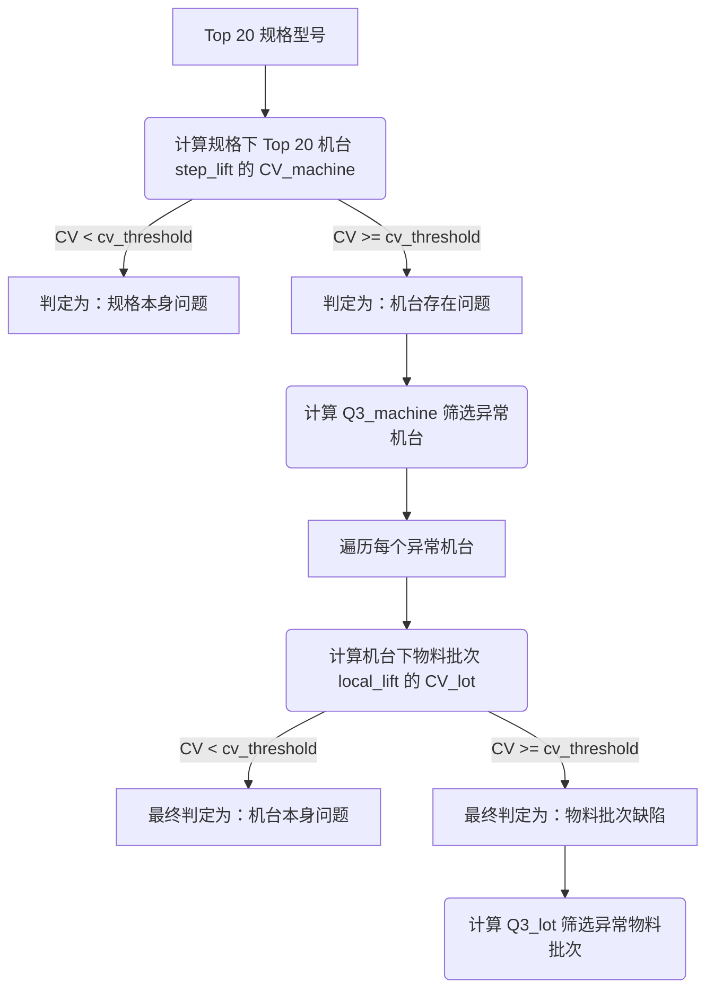

# CV 变异系数分级判异算法设计规范

本规范定义了轮胎质量分析看板中，对于高贡献率规格的二级下钻判异逻辑（规格 -> 机台 -> 物料）。该算法用于自动识别质量波动的根因是来自于产品规格本身、设备状态，还是具体的原材料物料批次。

---

## 一、 核心概念与计算公式

### 1. 变异系数 (Coefficient of Variation, CV)
变异系数用于衡量一组数据的离散程度：
$$CV = \frac{\sigma}{\mu}$$
其中：
- $\sigma$ 为总体标准差，计算公式为 `np.std(data, ddof=0)`。
- $\mu$ 为样本均值，计算公式为 `np.mean(data)`。
- 当 $\mu = 0$ 时，定义 $CV = 0$。

### 2. 上四分位数 (Third Quartile, Q3)
上四分位数用于确定高风险离群值的过滤阈值：
$$Q3 = P_{75}(data)$$
计算公式为 `np.percentile(data, 75)`。

### 3. 判定逻辑
- **低离散度 ($CV < CV_{limit}$)**：表明各维度分布均匀，数据没有明显的单点偏高，判定为**系统性/整体性问题**。
- **高离散度 ($CV \ge CV_{limit}$)**：表明数据存在高波动和局部偏高现象，判定为**局部性/离群点问题**。此时，将所有数值 $\ge Q3$ 的对象定义为**异常对象**。

---

## 二、 双层分级判异流程

算法采用自上而下的树状排查结构：

### 🚀 第一层：规格 - 机台判异 (Spec-to-Machine Level)
1. **数据输入**：
   - 获取核心规格排行中的 Top 20 规格（`article10`）。
   - 对于每一个规格，获取其在研究期内对应的工位机台列表（Top 20）及各自的 `step_lift`（异常提升度）。
2. **计算与判定**：
   - 计算这组机台 `step_lift` 值的变异系数 $CV_{machine}$。
   - **结论 1**：若 $CV_{machine} < CV_{limit}$，则判定为**规格本身问题**（说明该规格在所有加工机台上异常分布均匀，应排查规格配方或结构设计）。
   - **结论 2**：若 $CV_{machine} \ge CV_{limit}$，则判定为**机台存在问题**。
3. **定位异常机台**：
   - 对于判定为“机台存在问题”的规格，计算这组机台 `step_lift` 的上四分位数 $Q3_{machine}$。
   - 凡是满足 $step\_lift \ge Q3_{machine}$ 且异常数 $\ge 3$ 的机台，均被定义为该规格下的**异常机台**。

### 📦 第二层：机台 - 物料判异 (Machine-to-Lot Level)
针对第一层识别出的每个**异常机台**进行物料级深度溯源：
1. **数据输入**：
   - 读取异常机台对应的工序列 `workcenter_col` 与机台名称 `machine`，通过 `LOT_MAP` 找到对应的原材料物料列 `lot_col`。
   - 拉取该规格下流经该机台的物料批次数据。
   - **样本过滤**：物料批次的样本筛选逻辑（如排产量门槛、最小异常数等）与后端现有批次诊断逻辑及过滤参数完全保持一致，不进行单独定义。
   - 对每个物料批次，计算其在该机台的局部异常提升度 `local_lift`：
     $$local\_lift = \frac{\text{批次在该机台异常率}}{\text{机台整体异常率}}$$
2. **计算与判定**：
   - 计算这组物料批次 `local_lift` 值的变异系数 $CV_{lot}$。
   - **结论 3**：若 $CV_{lot} < CV_{limit}$，则判定为**机台本身问题**（说明所有原材料批次在该机台的异常率均处于均等偏高水平，设备零点漂移或硬件磨损概率极高，建议校验设备）。
   - **结论 4**：若 $CV_{lot} \ge CV_{limit}$，则判定为**物料批次缺陷**。
3. **定位异常物料**：
   - 对于判定为“物料批次缺陷”的设备，计算这组物料 `local_lift` 的上四分位数 $Q3_{lot}$。
   - 凡是满足 $local\_lift \ge Q3_{lot}$ 的批次，均被定义为该机台下的**异常物料批次**。

---

## 三、 配置性、健壮性与计算一致性

1. **配置接口**：变异系数阈值 $CV_{limit}$ 默认值为 `0.4`，由后端 API 提供入参支持动态设置。
2. **底层计算一致性**：规格、机台、物料的所有异常数、总产量、提升度计算逻辑必须与现有后端计算及图表展示口径保持 100% 一致。
3. **判定结果互斥规则 (Mutual Exclusivity Rule)**：
   - 每一个质量异常路径的根因判定是**唯一且互斥**的，避免重复报警：
     - 若最终判定为 **“物料批次缺陷”**，则该警报 **仅** 展示在**物料预警卡片**上，**不能** 同时作为机台问题展示在机台卡片上，也 **不能** 展示在规格卡片上。
     - 若最终判定为 **“机台本身问题”**，则该警报 **仅** 展示在**机台预警卡片**上，**不能** 展示在规格卡片上。
     - 若最终判定为 **“规格本身问题”**，则该警报 **仅** 展示在**规格预警卡片**上。

4. **无对应物料列的工序机台退化机制 (Fallback Logic)**：
   - 在进行“机台-物料”层级判异时，如果异常机台所属的工序（`workcenter_col`）在系统的 `LOT_MAP` 中没有对应的物料批次列（`lot_col` 为空/未配置），则算法直接在此处终止并向下截断，**最终判定为“机台本身问题”**。

5. **小样本数据保护机制 (Small Sample Protection)**：
   - **规格-机台层**：如果某规格在研究期内流经的有效工位机台数 $\le 1$（无法进行横向离散对比），则直接跳过该规格，不生成该规格下的机台预警。
   - **机台-物料层**：如果某异常机台下符合过滤门槛的物料批次样本数 $\le 1$（无法进行批次间横向离散对比），则直接向下截断，**最终判定为“机台本身问题”**。
   - **均值为零保护**：如果提升度均值或局部提升度均值为 `0`，则强制设定 $CV = 0$，防止运行中除以零报错。

---

## 四、 预警卡片与联动交互设计规范

### 布局位置调换 (Layout Swap)
- 将**产量与异常率趋势走势**图表移动至整个仪表盘的最顶端（第一行，Row 1）。
- 将**智能诊断预警卡片面板**移动至其下方（第二行，Row 2）。

预警面板由 4 张固定卡片组成，根据诊断结论呈现不同的红/绿颜色状态。各卡片上仅进行直白的信息展示，无操作引导和交互按钮：

### 📊 1. 生产期整体质量分析报告 (全局卡片)
- **展示内容**：展示研究期排产数量、质量异常数、分析天数、基准期与研究期异常率波动。
  - *文字内容*：`研究期排产 [排产数] 条，质量异常 [异常数] 条，分析时间为 [天数] 天。基准期异常率 [基准率]% → 研究期异常率 [研究率]%（较基准期波动了 [波动百分点] 百分点）`
- **颜色状态**：
  - 🟢 **恒为绿色 (成功状态/正常)**：作为系统概览数据展示。

### 🟡 2. 规格预警卡片 (基于第一层判定)
- **展示内容**：
  - 🔴 **红色 (有异常)**：当存在规格被判定为“规格本身问题”（即 $CV_{machine} < CV_{limit}$）。如果有多个规格有问题，并排拼接展示。
    - *文字模板*：`[规格名称1] [规格名称2] ... 存在规格缺陷`
  - 🟢 **绿色 (无异常)**：未检测到规格设计或配方缺陷。
    - *文字模板*：`未检测到规格本身设计或配方引起的系统性质量缺陷，各规格运行状态平稳。`

### ⚙️ 3. 机台预警卡片 (基于第二层判定 - 机台问题)
- **展示内容**：
  - 🔴 **红色 (有异常)**：当存在机台被判定为“机台本身问题”（即 $CV_{lot} < CV_{limit}$）。如果存在多个，并列拼接展示。
    - *文字模板*：`在规格 [规格名称] 下，机台 [工序:机台名称] 异常提升度达 [提升度]x。 在规格 [规格名称] 下，机台 [工序:机台名称] 异常提升度达 [提升度]x。`
  - 🟢 **绿色 (无异常)**：未检测到机台系统性参数偏移或硬件故障。
    - *文字模板*：`各工序设备精度与硬件状态良好，未检测到显著的机台系统性参数偏移。`

### 📦 4. 物料预警卡片 (基于第二层判定 - 物料问题)
- **展示内容**：
  - 🔴 **红色 (有异常)**：当存在物料批次被判定为“物料批次缺陷”（即 $CV_{lot} \ge CV_{limit}$）。如果存在多个，并列拼接展示。
    - *文字模板*：`在规格 [规格名称] 的机台 [工序:机台名称] 上，物料批次 [批次号] 的局部异常拉升达 [倍数]x`
  - 🟢 **绿色 (无异常)**：未检测到原材料物料批次缺陷。
    - *文字模板*：`各流转环节的原材料物料批次质量表现均等，未检测到异常集中的物料批次。`

