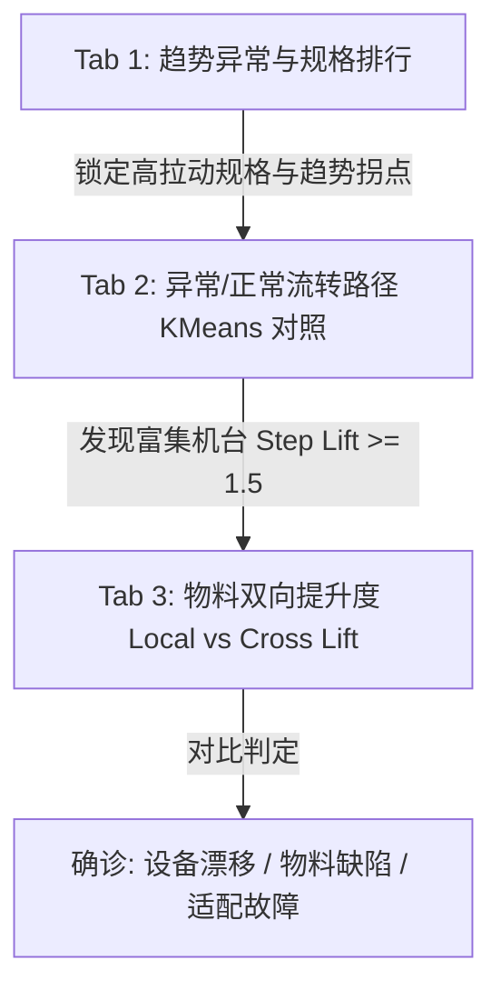

# 轮胎质量分析系统：全链路归因与算法重构实施方案

本案旨在彻底解决前一阶段实现中出现的**正常对照组 Step Lift 全等于 1.0**、**规格下钻污染下游**、以及**深度诊断图表挤压**等痛点。本实施方案提供详细的前后端重构路径，供开发与执行参考。

---

## 1. 业务目标与归因架构

系统采用 **“宏观趋势发现（Tab 1） -> 路径/设备富集排查（Tab 2） -> 微观物料批次确诊（Tab 3）”** 三层递进式架构。其核心在于将“绝对异常件数”转化为基于统计学的“提升度（Lift）”与“贡献度（Shift-Share）”，以自我归一化的指标克服排产产量波动对根因定位的误导。



---

## 2. 后端数据流与核心计算逻辑

### 2.1 动态规格靶向算法 (Shift-Share)
后端首先在研究期内计算各规格型号对全局异常率变动的拉动贡献：
$$\text{Contribution}_i = \left( \frac{\text{Anomaly}_{study, i}}{\text{Total}_{study, global}} - \frac{\text{Anomaly}_{base, i}}{\text{Total}_{base, global}} \right) \times 100$$
计算完成后，规格按贡献度绝对值从大到小降序排列，依次累加贡献率，直到达到 **$80\%$** 时截断。
> **注意**：后续的 KMeans 路径聚类、嫌疑机台和 Lot 对照分析**全部且仅在**这 $80\%$ 核心规格的数据子集上进行，彻底过滤长尾噪音。

### 2.2 肘部法 (Elbow Method) 自动聚类数推荐
在对异常/正常样本的独热编码（One-Hot）路径矩阵进行聚类时，不再硬编码 $K=2$，而是采用肘部曲线的二阶导数极值点进行智能判断：
1. **测试范围**：设定 $K \in [1, 7]$。若样本数小于 10，则跳过聚类，默认 $K=3$。
2. **计算 Inertia**：对每个 $K$ 跑 `KMeans(n_clusters=k, random_state=42, n_init=5)`，获取其簇内平方和 `inertia_`。
3. **二阶导数定位**：
   $$\text{diff}_1 = \text{np.diff}(\text{inertias})$$
   $$\text{diff}_2 = \text{np.diff}(\text{diff}_1)$$
   $$\text{Best } K = K_{\text{range}}[\text{np.argmax}(\text{diff}_2) + 1]$$
   该拐点代表簇内平方和下降速度减缓的第一个临界点，以此作为最优聚类数量。

### 2.3 正常对照组多簇聚类 (消除 Step Lift = 1 偏差)
* **原因分析**：正常样本数占大盘的 98% 以上。如果不聚类，其流转路径的分布即等于自然大盘分布，造成 Step Lift $\equiv 1.0$。
* **重构逻辑**：
  对正常样本（随机下采样限制最多 20,000 条以提升计算性能）执行与异常样本相同的 One-Hot 编码与 KMeans 聚类（K 值由肘部法动态确定）。
* **多簇特征输出**：
  聚类后，将生成多个正常类工艺主导路径画像（如 `normal_cluster_0`、`normal_cluster_1`...）。由于进行了分簇，特定簇内的正常路径会展现出正常的工序机台组合富集，计算出的 **Step Lift 将恢复出真实的非 1.0x 波动**，与 Notebook 数据完全契合。

### 2.4 批次双提升度诊断 (Local vs Cross-Machine Lift)
针对选中的机台 $M$ 与特定异常簇：
* **本机局部提升度 (Local Lift)**：
  $$\text{Local Lift}_{\text{lot}} = \frac{\text{Anomaly}_{\text{lot, M}} / \text{Anomaly}_{\text{M, cluster}}}{\text{Total}_{\text{lot, M}} / \text{Total}_{\text{M}}}$$
* **全厂交叉提升度 (Cross-Machine Lift)**：
  $$\text{Cross-Machine Lift}_{\text{lot}} = \frac{\text{Anomaly}_{\text{lot, M}} / \text{Total}_{\text{lot, M}}}{(\text{Anomaly}_{\text{lot, global\_cluster}} + 1e-8) / (\text{Total}_{\text{lot, global\_study}} + 1e-8)}$$
* **诊断决策矩阵**：
  * **适配性故障**：$\text{Local Lift} > 1.5$ 且 $\text{Cross Lift} > 1.5$ $\rightarrow$ 该物料仅在本台机器上表现极差，属于“机台-批次不兼容”。
  * **全局缺陷**：$\text{Local Lift} > 1.5$ 且 $\text{Cross Lift} \le 1.5$ $\rightarrow$ 该物料在全厂所有设备上表现均差，属于“原材料质量通病”。
  * **设备系统漂移**：没有任一物料批次出现局部高提升度 $\rightarrow$ 任何料在本设备上均表现较差，判定为“机台自身物理漂移”。

---

## 3. 前端交互与布局设计

### 3.1 全局过滤器解耦
* **Tab 1 本地化**：用户在 Tab 1 右侧的规格排行图表中点击规格时，仅通过本地 Ref 触发左侧 TrendChart 的单规格趋势更新。
* **下游独立性**：Pinia Store 中的全局 `selectedArticle` 不会被 Tab 1 规格排行点击污染。Tab 2（路径）与 Tab 3（诊断）的 API 请求中**移除** `article10` 过滤字段，使其始终工作在 80% 核心规格的数据池中。

### 3.2 Tab 1: 总览与趋势 (防压缩大图表与预警卡片)
* **布局**：左右分栏（左 1.6 趋势图，右 1 核心规格排行 ECharts 横向柱状图），高度固定为 `380px`，开启 `autoresize`。
* **预警卡片 (InsightsPanel)**：
  * **红色高危卡片**：列出后端通过 KMeans 聚类筛选出的所有 `Step Lift >= 1.5` 的嫌疑机台，并显示其工序与确诊意见。可在一个卡片内列出多个设备，避免卡片臃肿。

### 3.3 Tab 2: 根因定位 (跳转交互、常规簇路径与样本过滤)
* **样本量过滤门槛 (用户可自定义输入)**：
  * **交互与设计**：在 Tab 2 顶部的控制工具栏中，增加一个数字输入框 `el-input-number`（默认值 50，步长 10，下限 0）。
  * **作用范围**：用户可以手动输入该数值，用于过滤掉生产排产量较少、样本量过低而缺乏代表性的冷门机台、故障路径或双工位联合批次。
  * **联动逻辑**：该过滤值改变时，直接作为动态参数 `min_yield` 传递给后端，自动刷新左侧机台排行、右侧特征对比表与底部的联合路径风险表。
* **左侧**：工位机台排行 Top 20。
  * **跳转交互**：绑定 ECharts 柱条点击事件。当点击柱条时，触发机台选中事件并自动跳转到 Tab 3。
* **右侧**：制造工序主导路径对比特征表。
  * **控制单选组**：`[异常类-故障簇 0]`、`[异常类-故障簇 1]` ... `[正常类-常规簇 0]` ...（单选按钮根据后端返回的 Cluster 数量动态生成）。
  * **表格列结构**：工序步骤、首选设备机台（渲染为链接样式按钮）、集中度 (%)、全量自然基准占比 (%)、Step Lift。
  * **跳转交互**：点击“首选设备机台”链接 $\rightarrow$ 自动触发选中该机台并跳转到 Tab 3。
  * **广播横幅**：当存在 `Step Lift >= 1.5` 的工位主导机台时，在表格上方弹出 `el-alert` 提示富集机台名单。
* **底部**：双机台联合路径风险对（Joint Pair Risk）。

### 3.4 Tab 3: 深度诊断 (无表单防横向压缩与批次过滤)
* **无表单设计**：移去左侧重复的嫌疑机台表格。
* **顶部控制条**：提供一个 `el-select` 下拉选择框（数据源于 `/api/diagnose/suspects`）。用户可从下拉框中随时重新挑选机台，或由 Tab 2 跳转时自动在此激活选中机台。
* **物料过滤联动**：Tab 2 设置的“样本量过滤门槛”也将作为参数 `min_total` 实时传递给 `/api/diagnose/lots` 接口，以便在该机台下的物料批次诊断中，同步过滤掉小样本量、排产量少的冷门 lot 批次。
* **下部通栏布局**（彻底防止 ECharts 柱状图挤压）：
  * **诊断诊断卡 (Verdict Card)**：占满宽，直观展示确诊结论与详细的车间排查指导。
  * **双向提升度对称柱状图 (LotCompareChart)**：占满宽，高度 `400px`，X 轴批次标签倾斜 $20^{\circ}$ 以防重叠，清晰展示本机与全厂交叉对比的双色柱条。

---

## 4. 接口定义 (API Contract)

### 4.1 `/api/diagnose/paths` (工艺路径对比)
* **请求方式**：`GET`
* **参数**：
  * `study_from`: `YYYY-MM-DD` (必填)
  * `study_to`: `YYYY-MM-DD` (必填)
  * `min_yield`: `integer` (可选，默认 50，来自于 Tab 2 自定义样本过滤框)
* **返回格式**：
  ```json
  {
    "status": "success",
    "data": {
      "anomaly_cluster_0": [
        { "step": "ct", "machine": "CUJ06", "concentration_ratio": 32.5, "natural_baseline": 6.2, "step_lift": 5.24 }
      ],
      "anomaly_cluster_1": [...],
      "normal_cluster_0": [
        { "step": "ct", "machine": "CUJ08", "concentration_ratio": 18.2, "natural_baseline": 15.1, "step_lift": 1.21 }
      ],
      "normal_cluster_1": [...]
    }
  }
  ```

### 4.2 `/api/diagnose/lots` (物料批次诊断)
* **请求方式**：`GET`
* **参数**：
  * `study_from`: `YYYY-MM-DD` (必填)
  * `study_to`: `YYYY-MM-DD` (必填)
  * `machine`: `M5_Machine` (必填)
  * `workcenter_col`: `tread_workcenter` (必填)
  * `cluster_id`: `0` (必填)
  * `min_total`: `integer` (可选，默认 50，对应 Tab 2 输入的过滤门槛)
  * `min_anomaly`: `integer` (可选，默认 3)
* **返回格式**：
  与原批次诊断一致，包含 `local_lift`、`cross_machine_lift`、`diagnosis` 与 `suggestion`。

---

## 5. 实施路线图

1. **第一阶段：后端重构**
   * 修改 `kmeans_service.py`：实现肘部确定法推荐 K 值函数 `auto_determine_k`；对正常组进行 KMeans 聚类；修改 `get_kmeans_diagnostics` 中正常路径字典的生成。
   * 修改 `main.py`：保证 `/api/insights` 预警红卡中列出所有 Step Lift 偏高的聚类嫌疑机台；确保 Tab 2 & 3 相关接口不再依赖全局规格过滤。
2. **第二阶段：前端组件开发**
   * 修改 `MachineChart.vue` 和 `Dashboard.vue`：添加 ECharts 柱条点击与跳转逻辑；将规格排行仅限 Tab 1 本地化。
   * 修改 `DiagnosticsPanel.vue`：改版为“顶部下拉框 + 满宽诊断卡 + 满宽对极 Lot 柱状图”。
3. **第三阶段：联调测试**
   * 测试从 Tab 2 点击机台是否顺畅跳转至 Tab 3；
   * 测试正常对照组切换为“常规簇 0 / 1”后 Step Lift 是否正确显示（不再是恒等于 1）；
   * 测试生产环境编译 `npm run build` 成功。
