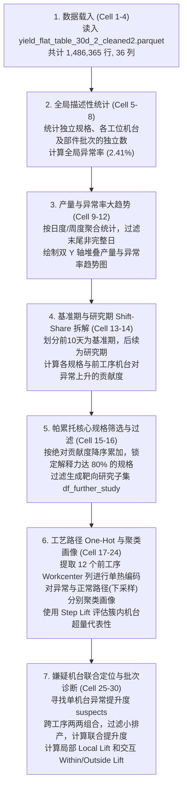

# 📊 Jupyter Notebook (data_analysis2.ipynb) 数据流转与计算逻辑审计报告

本报告针对 [data_analysis2.ipynb](file:///e:/111/data_analysis2.ipynb) 轮胎制造质量分析的完整代码、数据流向、计算公式、过滤条件以及业务口径进行系统性的审计与详解，以确保数据分析逻辑的严密性与计算公式的准确度。

---

## 1. 数据生命周期与流转全景 (Data Flow Blueprint)

整个分析流程采用“漏斗式”的递进筛选与重组架构，数据流转主要经历以下 7 个核心阶段：

### 1.1 数据流转脉络图



### 1.2 数据过滤与维度演变详细对照表

| 序号 | 流转阶段 / 变量 | 数据源 | 过滤与清洗规则 (Filtering Criteria) | 维度/样本量变化说明 |
| :--- | :--- | :--- | :--- | :--- |
| **1** | **原始载入** `df` | Parquet 文件 | 无过滤，读取完整已清洗的 30 天轮胎平表数据。 | 1,486,365 行，36 列 |
| **2** | **日度趋势统计** `daily_stats` | `df` | 1. 提取 `ct_shiftdate` 的日期。<br/>2. 丢弃最后一天（`.iloc[:-1]`），防范因数据未收尾带来的统计失真。 | 聚合降维至天数行，包含：总产量、正常量、异常量、异常率。 |
| **3** | **周度趋势统计** `weekly_stats` | `df` | 提取 `ct_shiftdate` 的周起始日期（每周一）。 | 聚合降维至周数行。 |
| **4** | **基准期数据** `df_baseline` | `df` | 过滤 `ct_shiftdate` 在 baseline 范围的行（默认前10天，即 `min_date_val` 到 `min_date_val + 9`）。 | 约 30% 样本量（根据排产而定） |
| **5** | **研究期数据** `df_study` | `df` | 过滤 `ct_shiftdate` 在 study 范围的行（第11天到 `max_date_val`）。 | 约 70% 样本量，代表质量发生异常波动的观测期。 |
| **6** | **融解工序空间** `df_baseline_melt` / `df_study_melt` | `df_baseline` / `df_study` | 1. 仅提取 12 个前工序工艺步骤列（排除 `tu_`、`tb_`、`tg_` 检测端）。<br/>2. 舍弃机台编码为空 (NaN) 的记录。 | 数据集发生 Melt 转换，转为长表，行数变为原先的约 12 倍。 |
| **7** | **靶向核心子集** `df_further_study` | `df_study` | 仅保留属于 **80% 累计绝对贡献率** 的关键规格（`target_articles`）的行。 | 剔除了非主导异常波动的规格，**后续聚类与交互诊断均以此为唯一数据源**。 |
| **8** | **聚类输入矩阵** `X_encoded` | `df_further_study` | 1. 填充 12 个前工序机台列的 NaN 值为 `'Missing'`。<br/>2. 转换为 string 类型，执行 `pd.get_dummies`。 | 样本数与 `df_further_study` 一致，特征维度扩展为 One-Hot 稀疏维度（如数千维）。 |
| **9** | **正常工艺聚类** | `X_encoded[is_normal]` | 随机下采样提取 `sample_size=20000` 条记录进行拟合。 | 将运算量级从几十万行压缩至 2 万行，保证秒级内输出，避免内存挂起。 |
| **10** | **批次局部诊断** | `df_further_study` | 针对特定嫌疑机台：<br/>1. 批次在当前机台上的**总排产数 > 30 条**。<br/>2. 批次在当前机台上的**异常胎数 $\ge 5$ 条**。 | 过滤小排产批次，消除偶然性偏离噪音。 |
| **11** | **交互热力图诊断** | `df_further_study` | 针对特定批次与规格组合（Cell 单元格）：<br/>单元格排产数量**必须 $\ge 10$ 条**（`cell_min_qty`），否则置为 NaN 灰色遮罩。 | 过滤小样本规格排产，保障热力图 Lift 结果的统计显著性。 |

---

## 2. 核心数学公式与计算逻辑详解 (Mathematical Formulas)

### 2.1 Shift-Share 异常率变动贡献度分解 (Cell 14)
该分析用于解耦“基准期”到“研究期”整体异常率变化 $\Delta R$ 的主导驱动源。整体变化可完美线性拆解为各因子的贡献之和：
$$\Delta R = R_{\text{study}} - R_{\text{baseline}} = \sum_{i} \text{Contribution}_i$$

对于单个因子 $i$（例如某一特定规格型号 `article10`），其贡献百分点（Percentage Points）计算公式为：
$$\text{Contribution}_i = \left( w_{i, S} \cdot r_{i, S} - w_{i, B} \cdot r_{i, B} \right) \times 100\%$$

* **权重比例 ($w$)**：该因子在对应时期的排产占比
  $$w_{i, S} = \frac{N_{i, S}}{N_S}, \quad w_{i, B} = \frac{N_{i, B}}{N_B}$$
* **异常率 ($r$)**：该因子在对应时期的自身质量异常率
  $$r_{i, S} = \frac{A_{i, S}}{N_{i, S}}, \quad r_{i, B} = \frac{A_{i, B}}{N_{i, B}}$$
  *(其中 $N_S, N_B$ 为研究期和基准期的总样本量；$N_{i, S}, N_{i, B}$ 为因子 $i$ 的排产样本数；$A_{i, S}, A_{i, B}$ 为因子 $i$ 的异常记录数)*

> [!NOTE]
> **机台贡献度的融解空间 (Melted Space) 修正**：
> 一条轮胎由于流经 12 个不同工段，在机台维度计算时，原轮胎样本空间被 `melt` 重塑。由于各工段可能存在局部缺失值，融解后的空间异常率与原轮胎异常率有微弱的闭合差（通常小于 $10^{-6}$），但在融解长表空间内，Shift-Share 分解依然保持 $100\%$ 的数学闭合。

---

### 2.2 Step Lift (工艺路径簇内相对提升度) (Cell 22)
在聚类画像中，若直接使用绝对占比 $P(\text{Machine} \mid \text{Cluster})$ 来评估，会因为“某些工段（如胎面）物理机台极少，天然占比高”而产生误警。因此引入了 Step Lift：
$$\text{Step Lift}_M = \frac{P(M \mid C)}{P(M) + 10^{-8}}$$

* **簇内工艺集中度 ($P(M \mid C)$)**：机台 $M$ 在该聚类簇中的频数占比：
  $$P(M \mid C) = \frac{\text{机台 } M \text{ 在当前簇内的频数}}{\text{当前簇的总样本数}}$$
* **全量自然基准占比 ($P(M)$)**：机台 $M$ 在整个靶向研究数据集（`df_further_study`）中的自然排产比例：
  $$P(M) = \frac{\text{机台 } M \text{ 在全量核心规格中的频数}}{\text{全量核心规格总排产量}}$$

---

### 2.3 单机台 Step Lift 异常提升度 (Cell 26)
评估在靶向核心规格数据中，流经某一具体物理设备 $M$ 的异常率相对超量表现：
$$\text{Step Lift}_{\text{machine}} = \frac{P(M \mid \text{Anomaly})}{P(M \mid \text{Normal}) + 10^{-8}}$$

* **分子 $P(M \mid \text{Anomaly})$**：异常轮胎中流经机台 $M$ 的比例
  $$P(M \mid \text{Anomaly}) = \frac{\text{机台 } M \text{ 加工的异常胎数}}{\text{总异常胎数}}$$
* **分母 $P(M \mid \text{Normal})$**：正常轮胎中流经机台 $M$ 的比例
  $$P(M \mid \text{Normal}) = \frac{\text{机台 } M \text{ 加工的正常胎数}}{\text{总正常胎数}}$$

---

### 2.4 双机台联合提升倍数 (Joint Combination Lift) (Cell 26)
评估两条前工序工艺路线上的机台 $M_1$ 与 $M_2$ 联合加工时，是否会因产生某种“物理干涉或累加误差”而导致异常率倍增：
$$\text{Joint Lift}_{(M_1, M_2)} = \frac{P(\text{Anomaly} \mid M_1 \cap M_2)}{\text{Baseline Anomaly Rate} + 10^{-8}} = \frac{A_{(M_1, M_2)} / T_{(M_1, M_2)}}{\text{Baseline Anomaly Rate} + 10^{-8}}$$

* **联合实际异常率 ($P(\text{Anomaly} \mid M_1 \cap M_2)$)**：同时经过 $M_1$ 与 $M_2$ 加工的轮胎的异常比例：
  $$\text{Anomaly Rate} = \frac{\text{同时经过 } M_1 \text{ 和 } M_2 \text{ 的异常胎数 } A_{(M_1, M_2)}}{\text{同时经过 } M_1 \text{ 和 } M_2 \text{ 的总排产胎数 } T_{(M_1, M_2)}}$$
* **全局基准异常率 ($\text{Baseline Anomaly Rate}$)**：当前靶向规格在研究期内的平均异常率：
  $$\text{Baseline Anomaly Rate} = \frac{\text{研究期内核心规格的异常总胎数}}{\text{研究期内核心规格的总排产胎数}}$$

---

### 2.5 物料批次双基准对照诊断 (Cell 28)
用于解耦“设备缺陷”与“物料批次质量缺陷”。对嫌疑机台 $M$ 上使用的所有批次 $L$ 计算以下两项指标：

#### ① Local Lift (机台内提升度)
$$\text{Local Lift} = \frac{A_{M, L} / A_M}{T_{M, L} / T_M} = \frac{A_{M, L} / T_{M, L}}{A_M / T_M}$$
* **物理意义**：该物料批次在此设备上的实际异常率与该设备整体平均异常率的比值。Local Lift > 1.5 说明该批次是该机台异常的主要贡献源。

#### ② Cross-Machine Lift (跨机台对照度 - 联想推导)
$$\text{Cross-Machine Lift} = \frac{A_{M, L} / T_{M, L}}{A_{G, L} / T_{G, L} + 10^{-8}}$$
* **物理意义**：该批次在此机台上的异常率与其在全局所有设备上平均异常率的比值。

#### 💡 诊断决策矩阵 (Business Diagnostics Matrix)

| Local Lift | Cross-Machine Lift | 诊断结论 | 对应业务治理建议 |
| :---: | :---: | :--- | :--- |
| **高 (>1.5)** | **高 (>1.5)** | **机台-批次适配性故障 / 相性不良**：该物料批次仅在此嫌疑设备上频繁产生报废，而在其他同工序设备上表现正常。 | 应对该机台的张力控制器、温度传感器、特定材质下的加工精度进行精细化微调。 |
| **高 (>1.5)** | **接近 1.0** | **全局物料批次自身缺陷 (Systemic Lot Issue)**：该批次在此嫌疑机台异常率高，且在全局其他机台的异常率也普遍偏高。 | 判定为上游原材料批次存在系统性物料缺陷，应立即对该批次（Lot）进行下线封存与追溯。 |
| **接近 1.0** | **高 (>1.5)** | **设备系统性工艺漂移 (Machine Degraded)**：该批次在此机台异常率偏高，但与该机台加工的其他批次异常率基本持平。 | 排除物料影响，该物理机台已发生系统性性能衰退或零配件漂移，建议停机进行零点校验和校准。 |

---

### 2.6 批次与规格交互风险 Lift (Cell 30)
为了剖析故障究竟是“产品规格本身�  4. **簇画像过滤与排序**：
     对每个 Cluster 的每个工序，计算物理机台的簇内占比（集中度）以及自然排产基准占比，相除获得 `Step Lift`。
     - **画像规则**：对于正常类和异常类，各工段均只保留 Step Lift 最高的 Top 1 机台展示，并且整个列表按 Step Lift 降序排序，突出偏离度最大的高嫌疑工艺节点。

### CELL 23-24: 正常样本工艺路径聚类分析 (is_normal = True)
* **操作逻辑**：
  由于正常样本体量庞大，使用 `df_sub.sample(n=sample_size, random_state=42)` 随机抽取 20,000 条记录拟合 KMeans。
* **画像规则**：正常类同样使用 Step Lift 评估并仅展示 Top 1 首选机台，工艺路径表按照 Step Lift 降序排列。

### CELL 25-26: 异常聚类双机台联合 Step Lift 诊断
* **操作逻辑**：
  1. **分类候选集抽取**：在全局拟合 $K=2$ 的 KMeans 异常分类模型。对于每个异常聚类簇，在 12 个前工段中，分别提取 Step Lift 最高的 Top 5 物理机台作为嫌疑设备池。
  2. **跨工序两两组合**：使用 `itertools.combinations` 在工序候选机台间进行跨工段两两组合。
  3. **数据过滤与联合提升度计算**：
     - 在 `df_further_study` 中统计同时加工过这两个嫌疑机台的轮胎总数 `total_matches`。
     - **门槛判定**：`total_matches >= 50`（保证存在联合排产，排除偶然性波动干扰）。
     - 计算联合 Step Lift：`joint_step_lift = (anomaly_matches_in_cluster / cluster_size) / (total_matches / total_all)`。
     - 对每个异常聚类簇，降序排列并展示 Top 10 高危联合机台组合。\text{Lift} = \frac{P(\text{Anomaly} \mid M \cap L \cap A)}{P(\text{Anomaly} \mid M) + 10^{-8}} = \frac{a_{L, A} / n_{L, A}}{\text{Anomaly Rate of Machine } M + 10^{-8}}$$

---

## 3. Jupyter Notebook 代码细节精确审计 (Cell-by-Cell Audit)

### CELL 1-4: 数据读取与环境设定
* **操作逻辑**：引入 matplotlib、pandas、numpy 库。通过 `ipynbname.path()` 获取自身绝对路径，利用 `pd.read_parquet` 载入 Parquet 文件。
* **过滤条件**：
  ```python
  data_path = os.path.join("data_clean", "E://111//yield_flat_table_30d_2_cleaned2.parquet")
  if not os.path.exists(data_path):
      data_path = "yield_flat_table_30d_2_cleaned2.parquet"
  ```
  实现了在 `data_clean` 相对目录与根目录下文件存在性的平滑检测。

### CELL 5-8: 规格、工位与批次描述性统计
* **计算方式**：
  1. 规格种类数：使用 `.nunique()` 统计非重复 `article10` 种类。
  2. 物理指标异常率：使用 `df['grade_anomaly_new'].value_counts()` 统计正常量 (0) 与异常量 (1)，利用 `.mean() * 100` 获得百分比。
  3. 各工位设备数：
     ```python
     wc_cols = [col for col in df.columns if 'workcenter' in col]
     wc_nunique = df[wc_cols].nunique()
     ```
     提取包含 `'workcenter'` 的列，执行非重复值统计。
  4. 部件批次独立数：提取包含 `'lot'` 的列，执行非重复值统计并排序。

### CELL 9-10: 日度产量与异常率变化趋势
* **操作逻辑**：
  1. `df['date'] = df['ct_shiftdate'].dt.date` 提取日期列。
  2. `df.groupby('date')['grade_anomaly_new'].agg(['count', 'mean'])` 聚合计算每日总样本量和异常率。
  3. **数据过滤**：`.iloc[:-1]` 丢弃最后一天（防止数据不完整造成的尾部下坠假象）。
  4. **计算公式**：
     - `anomaly_count = count * mean`（每日异常量）
     - `normal_count = count - anomaly_count`（每日正常量）
     - `anomaly_rate_pct = mean * 100`（每日异常率）
  5. **绘图逻辑**：左 Y 轴用堆叠柱状图 `ax1.bar()` 叠加正常与异常样本量；右 Y 轴用 `ax1.twinx()` 折线图绘制 `anomaly_rate_pct`。

### CELL 11-12: 周度产量与异常率变化趋势
* **操作逻辑**：
  1. `df['week_start'] = df['ct_shiftdate'].dt.to_period('W').dt.start_time` 将时间戳对齐至周一。
  2. 周度聚合，计算 `anomaly_rate_pct`。
  3. 绘图：左 Y 轴绘制周产量总柱图，右 Y 轴折线展示周异常率，并使用 `ax2.text()` 为折线上的点精准标注百分比文字。

### CELL 13-14: 规格型号与机台贡献度拆解 (核心逻辑)
* **操作逻辑**：
  1. 动态获取日期：`min_date_val` 和 `max_date_val`。
  2. **时间线切分**：
     - 基准期（Baseline）：`ct_shiftdate` 在 `min_date_val` 至 `min_date_val + 9` 之间（前10天）。
     - 研究期（Study）：`ct_shiftdate` 在 `min_date_val + 10` 至 `max_date_val` 之间（后20天）。
  3. **规格 Shift-Share 计算**：
     - 在基准期和研究期分别 GroupBy `article10` 聚合 count 和 sum。
     - 使用 `pd.merge(..., how='outer').fillna(0)` 合并，并运用 numpy 保护零除：
       ```python
       art_contrib['r_base'] = np.where(art_contrib['n_base'] > 0, art_contrib['anomaly_base'] / art_contrib['n_base'], 0.0)
       ```
     - 依据 Shift-Share 贡献度公式求出 `contribution_pct` 并校验和。
  4. **机台 Melt 长表转换与贡献度计算**：
     - 提取 12 个前工段工艺列：
       ```python
       wc_cols = [col for col in df.columns if 'workcenter' in col and not col.startswith(('tu_', 'tb_', 'tg_'))]
       ```
     - 重塑前，对机台名称拼接工序列名，以防同名机台跨工序混淆：
       ```python
       df_melt[col] = df_melt[col].apply(lambda x: f"{col}:{x}" if pd.notna(x) else np.nan)
       ```
     - 执行 `df.melt()`。在融解后的空间中计算各物理机台的贡献度，并校验其数学闭合差。
  5. Concat 两个维度的贡献度，排序并输出 Top 15 联合驱动排行以及维度绝对贡献度总和报告。

### CELL 15-16: 步长递增确定核心规格与数据筛选
* **操作逻辑**：
  1. 设置保留阈值 `threshold = 0.80`（即锁定累积解释力达到 80% 的规格）。
  2. 规格按绝对贡献度 `abs_contribution` 降序排列。
  3. **循环计算**：逐个累加规格绝对贡献，除以总规格绝对贡献量，直至占比 $\ge 80\%$ 时终止循环，锁定前 `selected_n` 个规格。
  4. **靶向数据集过滤**：
     - `df_study[df_study['article10'].isin(target_articles)]` 过滤出研究期内属于核心规格的数据 -> `df_further_study`。
     - `df_further_study[df_further_study['grade_anomaly_new'] == 1]` 过滤出核心规格中判定为异常的样本量 -> `df_further_study_anomalies`。

### CELL 17-20: 特征提取与单热编码 (One-Hot)
* **操作逻辑**：
  1. 选取 12 个前工序工艺列作为分类特征。
  2. 特征预处理：
     `df_cat = df_further_study[wc_cols].fillna('Missing').astype(str)`
     将空缺的工艺设备填充为 `'Missing'` 以便作为一类分类状态参与聚类，再转为 string。
  3. `pd.get_dummies(df_cat)` 生成 `X_encoded` 稀疏矩阵。

### CELL 21-22: 异常样本工艺路径聚类分析 (is_anomaly = True)
* **操作逻辑**：
  1. **KMeans 肘部法**：对异常样本矩阵拟合 $K \in [1, 7]$ 的 KMeans 模型，记录簇内平方和 `inertia_`。
  2. **智能拐点推荐**：
     计算 `inertias` 的一阶差分与二阶差分，将二阶差分极大值点对应的 $K$ 判定为最佳肘部拐点 `best_k`。
  3. 重新以 `best_k` 聚类。
  4. **簇画像与 Scheme B 过滤 (精细防噪)**：
     对每个 Cluster 的每个工序，计算物理机台的簇内占比（集中度）以及自然排产基准占比，相除获得 `Step Lift`。
     - **Scheme B 筛选门槛**：
       - 主导机台的 `Step Lift` 必须 $\ge 1.2$，且在异常中的绝对占比必须 $\ge 2\%$。
       - 后续候补机台的 `Step Lift` 相比上一个被选机台的 `Step Lift`，其降幅比例不能超过 50%（`ratio >= 0.5`），否则在此处发生断崖式下跌截断。

### CELL 23-24: 正常样本工艺路径聚类分析 (is_normal = True)
* **操作逻辑**：
  由于正常样本体量庞大，使用 `df_sub.sample(n=sample_size, random_state=42)` 随机抽取 20,000 条记录拟合 KMeans。
* **画像规则**：与异常样本不同，正常样本无需进行 Step Lift 提升度判定，仅输出各工序占比第一的设备（Top 1），用以勾勒出工厂在大生产环境下的自然首选工艺路线。

### CELL 25-26: 嫌疑设备定位与高危双机台工艺路径组合识别
* **操作逻辑**：
  1. 运行 $K=2$ 聚类，为两个异常簇下的各工段设备运行 Scheme B 降温截断，合并去重后得到嫌疑机台池 `unique_suspects`。
  2. **跨工段两两组合**：使用 `itertools.combinations` 在嫌疑机台池中两两配对，过滤掉同工序机台。
  3. **数据过滤与提升度计算**：
     - 在 `df_further_study` 中统计同时加工过这两个嫌疑机台的轮胎总数 `total_matches`。
     - **门槛判定**：`total_matches >= 50`（保证两机台存在联合排产，排除小排产组合的波动干扰）。
     - 计算 `comb_lift` 并展示 Top 10 高危联合机台对。

### CELL 27-28: 异常聚类簇主导机台的物料批次 (Lot) 风险提升度分析
* **操作逻辑**：
  1. 提取异常聚类中 Step Lift 排名前 8 的核心设备，通过 `lot_col_map` 关联其在轮胎平表中对应的原材料批次列（如将 `inner_liner_workcenter` 映射至 `inner_liner_lot`）。
  2. **双重过滤门槛 (Double Threshold Gate)**：
     对在当前嫌疑设备上加工过的物料批次，要求在该机台上的**总产量 > 30 条**且**关联的异常胎数 $\ge 5$ 条**。
  3. **计算公式**：
     - `anomaly_share = lot_anomaly_cnt / total_machine_anomalies`
     - `overall_share = lot_total_cnt / total_machine_tires`
     - `lot_lift = anomaly_share / overall_share`
  4. 绘制横向柱状图，并在柱体右侧使用 annotation 打印 `lot_lift` 与样本比例。

### CELL 29-30: 特定高危 Lot 与规格 (Article) 交互风险对照热力图
* **操作逻辑**：
  1. 设定 `selected_lot`，自动在 `df_study` 中定位其所属的工艺列、机台与所涉及的全部产品规格。
  2. 提取同机台生产该规格的对比批次，过滤排产量低于 30 的批次，选取前 10 个（目标批次 + 9个大排产对比批次）。
  3. **单元格数量修正**：
     遍历批次与规格组合，若该批次在当前规格下的排产数 **`n_lot_art_all < 10` (cell_min_qty)**，直接赋为 `np.nan` 并予以热力图灰色屏蔽（防止虚高 Lift 误导业务决策）。
  4. 支持三种公式模式：`vs_article`（以规格异常率为分母）、`vs_lot`（以批次异常率为分母）、`vs_machine`（以机台异常率为分母）。
  5. 绘制 `sns.heatmap` 并输出明细数据清单。

---

## 4. 关键健壮性与防噪设计审查结论 (Safety Controls)

### 4.1 零除风险审计 (Zero-Division Risk)
* **设计防线**：在各处涉及比值、提升度 (Lift) 计算的公式中，代码均在分母端引入了微小偏置常数 `+ 1e-8`（如 `(natural_pct + 1e-8)`、`(P_normal + 1e-8)`、`(overall_share + 1e-8)` 等），有效防止了由于某些冷门机台或批次在分子有数而分母为 0 时引发的程序崩溃（ZeroDivisionError）或生成 NaN。
* **审计判定**：**安全**。

### 4.2 特征/信息泄露审计 (Data Leakage)
* **设计防线**：在进行 KMeans 工艺特征 One-Hot 编码时，如果特征中混入了下游的质量检验端设备信息（如动平衡检测、几何测试等），会发生逻辑因果倒置（因为下游质检设备是在检测出异常后才会对异常轮胎进行分类分拣流转，将其用作前工序工艺分类会带来严重的泄露）。
* **审计判定**：**安全**。代码中通过 `not col.startswith(('tu_', 'tb_', 'tg_'))` 的条件过滤，严格剔除了检测端设备，只留下了纯粹的 12 个物理前工序加工设备，确保了聚类结果对于生产加工路径分类的纯净度与有效性。

### 4.3 统计噪点与过拟合审计 (Statistical Noise Control)
Jupyter Notebook 中设计了多层“统计保护防线”来过滤小排产样本的干扰：
1. **日统计降维**：使用 `iloc[:-1]` 剔除最后一天，规避非完整自然日造成的数据陡降假象。
2. **Shift-Share 贡献度筛选**：只提取累积贡献度排在前 80% 的“大头规格”作为靶向研究对象，舍弃剩余 20% 处于长尾、样本量极小且质量极其不稳定的规格。
3. **批次局部诊断门槛**：规定批次必须满足 $\text{总排产} > 50$ 且 $\text{异常数} \ge 5$，避开单条测试记录异常产生 $100\%$ 伪风险的逻辑陷阱。
4. **单元格级别交互屏蔽**：规格与批次交叉单元格在嫌疑机台上排产必须 $\ge 10$ 条，否则在热力图上直接以 NaN 灰色屏蔽。
* **审计判定**：**优秀，防噪设计极为合理**。

---

## 5. 持续改进与优化建议 (Recommendations)

1. **规避 NumPy 浮点数零除警告**
   在 Shift-Share 模块（Cell 14）中，虽然 `np.where` 可以规避最终结果的零除，但在计算分母包含 0 的除法时，Python 仍会抛出 `RuntimeWarning: divide by zero encountered`。建议将代码优化为：
   `art_contrib['r_base'] = art_contrib['anomaly_base'] / art_contrib['n_base'].replace(0, np.nan).fillna(0.0)`
   利用 Pandas 的 Series 替换机制，优雅地在计算前规避 0 值，使控制台日志输出更为整洁。

2. **超大型正常样本聚类算法的替换**
   当前对于几十万量级的正常样本，代码采用了 2 万条随机下采样以维持 KMeans 性能。为保证对冷门工艺路线的完全覆盖，后续可将 `sklearn.cluster.KMeans` 替换为 **`MiniBatchKMeans`**。它可以在不抛弃全量正常样本覆盖率的前提下，提供十倍以上的聚类拟合加速。

3. **异常诊断数据自动落盘**
   建议在 Notebook 末尾增加一个导出代码单元，自动将最终定位的“嫌疑机台排行榜 (suspect_pool)”、“高危机台组合 (comb_df)”以及“高危物料批次诊断表”输出为带有分析时间戳的 Excel 文件（例如 `quality_audit_report_20260625.xlsx`），方便工艺与车间设备维护人员进行物理排查。
